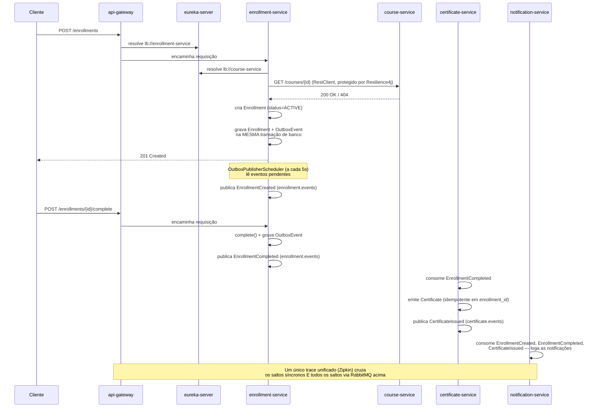

# EduFlow Cloud

[🇺🇸 English](README.md)

Uma plataforma de aprendizado online cloud-native, construída com 7 módulos Spring Boot independentes — 4 microsserviços de negócio por trás de uma infraestrutura Spring Cloud real (Config Server, Eureka, API Gateway) — projetada para fechar uma lacuna arquitetural específica deixada em aberto no meu projeto anterior: comunicação entre serviços via URL fixa, sem service discovery e sem configuração centralizada. Construído como projeto de portfólio para vagas de estágio/júnior em backend Java.

O sistema permite que um aluno se matricule num curso, conclua ele, e receba automaticamente um certificado — com cada etapa desse fluxo observável de ponta a ponta, resiliente a falhas parciais, e reconfigurável em tempo real sem reiniciar nenhum processo.

## Por que esse projeto

O [order-processing-system](https://github.com/Rangeldev73/order-processing-system) (meu projeto anterior) provou que eu conseguia construir uma SAGA coreografada real, com consumidores idempotentes, dead-letter queues e circuit breakers — mas cada serviço encontrava os outros através de uma URL fixa no código. Isso não escala, e não reflete como sistemas distribuídos reais são de fato conectados. O EduFlow Cloud existe especificamente pra fechar essa lacuna: service discovery dinâmico (Eureka), configuração centralizada e recarregável em runtime (Config Server + Spring Cloud Bus), um único ponto de entrada roteado (API Gateway), e rastreamento completo de requisições/eventos cruzando tanto chamadas síncronas quanto assíncronas (Micrometer Tracing + Zipkin). Em cima dessa infraestrutura, o projeto também revisita e resolve de forma correta um trade-off que eu tinha aceitado como débito técnico no projeto anterior — o problema de dual-write entre um commit de banco e a publicação de uma mensagem — através do padrão Transactional Outbox.

## Funcionalidades

- **4 microsserviços de negócio, totalmente conectados por eventos** — `course-service`, `enrollment-service`, `certificate-service`, `notification-service`, cada um com seu próprio bounded context e (onde aplicável) seu próprio banco PostgreSQL.
- **Stack de infraestrutura completa, não simulada** — Spring Cloud Config Server (baseado em Git, [repositório separado](https://github.com/Rangeldev73/eduflow-config)), Eureka (service discovery dinâmico), e Spring Cloud Gateway (ponto de entrada único, resolvendo `lb://course-service` e `lb://enrollment-service` dinamicamente em vez de endereços fixos).
- **Uma cadeia de eventos real, não um único salto** — `enrollment-service` publica `EnrollmentCreated`/`EnrollmentCompleted`; `certificate-service` consome o segundo, emite um certificado, e ele mesmo publica `CertificateIssued`; `notification-service` reage aos três. `certificate-service` é tanto consumidor quanto produtor.
- **Transactional Outbox Pattern** — `enrollment-service` não publica mais diretamente no RabbitMQ a partir do use case. Todo evento de saída é gravado numa tabela `tb_outbox_event`, na *mesma* transação de banco da escrita de negócio, garantindo que o evento nunca se perca mesmo que o RabbitMQ esteja inacessível naquele instante. Um publicador agendado separado (polling a cada 5s) lê as linhas pendentes e publica cada uma em sua própria transação.
- **Idempotência em cada fronteira de consumidor** — `certificate-service` trata a entrega "pelo menos uma vez" do RabbitMQ como um dado da realidade: uma constraint única em `enrollment_id` torna o reprocessamento de um `EnrollmentCompleted` duplicado uma operação inofensiva, não um certificado duplicado.
- **Resilience4j na única chamada síncrona do sistema** — `enrollment-service` valida que um curso realmente existe (via `RestClient`, balanceado via Eureka) antes de criar uma matrícula, protegido por circuit breaker (por fora) + retry (por dentro). Um "curso não existe" confirmado (404) e um "course-service inacessível" (circuito aberto) são dois resultados diferentes, deliberadamente distinguidos — o segundo nunca degrada silenciosamente pro primeiro.
- **Rastreamento distribuído cruzando chamadas síncronas *e* assíncronas** — Micrometer Tracing + Zipkin instrumentam o fluxo de negócio inteiro, incluindo produtores e consumidores do RabbitMQ (que *não* são rastreados por padrão e precisaram ser habilitados explicitamente), produzindo um único trace unificado desde o Gateway até a linha de log da notificação.
- **Reload dinâmico de configuração, sem reiniciar nada** — Spring Cloud Bus (sobre o mesmo broker RabbitMQ que já roda para os eventos de negócio) propaga uma única chamada `/actuator/busrefresh`, feita em qualquer uma das instâncias, para todo bean `@RefreshScope` nos 5 serviços de negócio.
- **Controle de concorrência otimista real, incluindo um gotcha do Hibernate documentado** — o `@Version` de `Course` *não* incrementa quando um `Module` é adicionado através da associação pai-filho gerenciada pelo JPA (o Hibernate só incrementa a versão em mudanças na própria linha "dona"). Um teste de concorrência dedicado provou isso, e a correção — `LockModeType.OPTIMISTIC_FORCE_INCREMENT` na leitura — é aplicada especificamente onde a invariante real do agregado (ordem dos módulos) precisa dela.
- **Pragmatic Domain Model, em contraste deliberado com meu trabalho anterior** — diferente do [CourtFlow](https://github.com/Rangeldev73/courtflow), que mantém as entidades de domínio totalmente separadas das entidades de persistência JPA, as classes de domínio deste projeto *são* as entidades JPA. Isso é um trade-off consciente para o escopo deste projeto (infraestrutura e comunicação entre serviços, não purismo de Clean Architecture) — documentado aqui, não deixado implícito.
- **Totalmente containerizado** — os 7 módulos, mais PostgreSQL, RabbitMQ e Zipkin, rodam como containers Docker atrás de um único `docker-compose up`, com healthchecks garantindo a ordem de inicialização correta automaticamente.
- **Cobertura de testes unitários nas invariantes de cada agregado** — `Course`/`Module` (ordem contígua, coleção encapsulada), `Enrollment` (guardas de transição de estado simétricas), `Certificate` (imutabilidade, formato do código), e `OutboxEvent` (guarda de publicação única), além de um teste de concorrência dedicado provando o gotcha de versionamento do Hibernate acima.

## Stack tecnológica

| Camada | Tecnologia |
|---|---|
| Linguagem / Runtime | Java 21 |
| Framework | Spring Boot 4.1 |
| Stack cloud | Spring Cloud 2025.1.2 — Config Server, Eureka, Gateway (variante MVC/blocking), Bus |
| Build | Maven (multi-module, um único pom.xml pai gerenciando as BOMs do Spring Boot + Spring Cloud) |
| Persistência | Spring Data JPA, PostgreSQL (um container, um banco por serviço que precisa) |
| Migrations | Flyway (schema como código de ponta a ponta — sem `ddl-auto`) |
| Mensageria | RabbitMQ (topic exchanges, conversão de mensagem JSON via Jackson, Transactional Outbox no `enrollment-service`) |
| Resiliência | Resilience4j (circuit breaker + retry) na única chamada síncrona entre serviços |
| Observabilidade | Micrometer Tracing + Zipkin, cruzando tanto chamadas HTTP quanto RabbitMQ |
| Testes | JUnit 5, AssertJ |
| Containerização | Docker Compose para a stack inteira — um `Dockerfile` dedicado por módulo (7 no total), mais PostgreSQL ×3, RabbitMQ e Zipkin, conectados na rede Docker com ordem de inicialização orientada por healthcheck |

## Arquitetura

### Serviços

| Serviço | Papel | Expõe REST | Banco de dados | Porta |
|---|---|---|---|---|
| `course-service` | Dono do catálogo de cursos — `Course` como aggregate root com `Module`s ordenados de forma contígua | `POST /courses`, `POST /courses/{id}/modules`, `GET /courses/{id}` | `course_db` | 8082 |
| `enrollment-service` | Dono do ciclo de vida da matrícula (`ACTIVE` → `COMPLETED`/`CANCELLED`), valida existência do curso de forma síncrona, publica eventos via padrão Outbox | `POST /enrollments`, `POST /enrollments/{id}/complete`, `POST /enrollments/{id}/cancel`, `GET /enrollments/{id}` | `enrollment_db` | 8081 |
| `certificate-service` | Consome `EnrollmentCompleted`, emite um `Certificate` de forma idempotente com código público de verificação, publica `CertificateIssued` | — | `certificate_db` | 8083 |
| `notification-service` | Consumidor terminal — reage a `EnrollmentCreated`, `EnrollmentCompleted` e `CertificateIssued`, loga uma notificação simulada | — | nenhum | 8084 |

### Infraestrutura

| Componente | Papel | Porta |
|---|---|---|
| `config-server` | Serve configuração centralizada, clonada do repositório Git [`eduflow-config`](https://github.com/Rangeldev73/eduflow-config) | 8888 |
| `eureka-server` | Service discovery dinâmico — todo serviço de negócio e o Gateway se registram aqui | 8761 |
| `api-gateway` | Ponto de entrada único roteado (`spring-cloud-starter-gateway-server-webmvc`); resolve `lb://course-service` e `lb://enrollment-service` via Eureka. Só roteamento nesta versão — ainda sem autenticação ou rate limiting | 8080 |
| RabbitMQ | Sustenta tanto os eventos de negócio (`enrollment.events`, `certificate.events`) quanto o canal de refresh de configuração do Spring Cloud Bus | 5672 / 15672 (management UI) |
| Zipkin | Coleta e exibe traces distribuídos cruzando os 5 serviços de negócio | 9411 |

### Fluxo de ponta a ponta



### Clean Architecture (por serviço de negócio)

```
domain/
  model/       → entidades JPA que SÃO o modelo de domínio (ver "Decisões de design" abaixo)
  exception/   → exceções de negócio

application/
  usecase/     → um use case por operação, orquestrando domínio + repositórios + chamadas externas
  dto/
    request/   → DTOs de request, Bean Validation como camada de defesa em profundidade sobre a validação de domínio
    response/  → DTOs de response

infrastructure/
  web/         → controllers, tratamento de exceção centralizado com contrato de erro consistente
  persistence/ → repositórios Spring Data JPA
  messaging/   → configuração do RabbitMQ, produtores, listeners, publicador do outbox (enrollment-service)
  client/      → RestClient balanceado para a única chamada síncrona entre serviços (só enrollment-service)
```

## Decisões de design que vale a pena ler

- **Domínio = entidade JPA, em contraste deliberado com o CourtFlow.** `Course`, `Enrollment` e `Certificate` deste projeto são anotados diretamente com `@Entity`/`@Id`/`@Column` — não existe uma camada separada de mapeamento de persistência. O CourtFlow mantém isso totalmente apartado. Os dois são trade-offs legítimos; o foco deste projeto é comunicação entre serviços e infraestrutura cloud, não purismo de Clean Architecture, e mostrar as duas abordagens em dois projetos de portfólio é, em si, o ponto.
- **Um campo `@Version` não protege o que você assumiria que protege.** Adicionar um `Module` a um `Course` só gera um `INSERT` na tabela filha — o Hibernate não incrementa a coluna `version` do pai, porque do ponto de vista dele a linha do pai nunca mudou. Um teste de concorrência dedicado provou que duas chamadas simultâneas a `addModule()` **não** disparam `OptimisticLockingFailureException` sob o `findById()` padrão. A correção usa `@Lock(LockModeType.OPTIMISTIC_FORCE_INCREMENT)` especificamente no caminho de leitura que precisa da garantia no nível do agregado, enquanto a `UNIQUE constraint` do banco em `(course_id, module_order)` continua sendo a rede de segurança final e incondicional.
- **O Transactional Outbox só existe onde o problema de dual-write foi realmente identificado e documentado — não copiado pra todo lugar.** `enrollment-service` é o único serviço que o usa. `certificate-service` ainda publica diretamente, protegido só por um try/catch que loga e engole uma falha do broker — um risco menor, explicitamente aceito, já que replicar o padrão completo ali não ensinaria nada novo.
- **Um "não encontrado" confirmado e um "inacessível" nunca são o mesmo valor de retorno.** `CourseClient.existsById()` retorna `true`/`false` só para uma chamada que realmente se completou (um 200 ou um 404 do `course-service`). Qualquer fallback do circuit breaker ou falha de transporte lança `CourseServiceUnavailableException` (→ 503) em vez disso — retornar `false` silenciosamente num timeout teria bloqueado uma matrícula válida por causa de uma instabilidade de rede transitória, não de uma regra de negócio real.
- **O rastreamento do RabbitMQ é opt-in, não automático.** Diferente das chamadas HTTP, que o Spring já instrumenta de fábrica, os produtores e consumidores do RabbitMQ precisaram de `spring.rabbitmq.template.observation-enabled` / `spring.rabbitmq.listener.simple.observation-enabled` explicitamente como `true` — senão um trace visivelmente pararia na fronteira do Gateway/REST e nunca mostraria os saltos via RabbitMQ que compõem a maior parte do comportamento real deste sistema.
- **`localhost` significa uma coisa diferente dentro de um container.** Toda configuração deste projeto originalmente apontava pra `localhost` (Eureka, Config Server, os datasources, RabbitMQ, Zipkin), porque todo processo rodava no mesmo host. Migrar pro Docker Compose quebrou isso silenciosamente a princípio — cada container tem seu próprio `localhost` isolado, então um serviço tentando alcançar `localhost:8761` de dentro do próprio container estaria procurando o Eureka dentro dele mesmo, não no container do `eureka-server`. A correção foi trocar cada uma dessas referências pelo nome do serviço no Docker Compose (`eureka-server`, `config-server`, `eduflow-rabbitmq`, etc.), que o DNS interno do Docker resolve automaticamente — incluindo dentro da configuração centralizada servida pelo repositório separado [`eduflow-config`](https://github.com/Rangeldev73/eduflow-config), que precisou do mesmo ajuste.
- **O Spring Boot 4.1 renomeou ou remodularizou silenciosamente várias coisas das quais este projeto depende**, cada uma descoberta ao esbarrar numa falha silenciosa em vez de uma mensagem de erro: a auto-configuração do Flyway foi pra um starter próprio (`spring-boot-starter-flyway`) e simplesmente não roda sem ele; `spring-boot-starter-web` foi renomeado pra `spring-boot-starter-webmvc`; a variante MVC do Spring Cloud Gateway usa o prefixo de propriedade `spring.cloud.gateway.server.webmvc.*`, não o reativo; o suporte a Zipkin foi pro `spring-boot-starter-zipkin`, com a propriedade agora em `management.tracing.export.zipkin.*`. Documentando isso aqui pra que a próxima sessão de debug (minha ou de qualquer pessoa) comece mais rápido.

## Como rodar

A stack inteira — os 7 módulos Spring Boot mais PostgreSQL, RabbitMQ e Zipkin — roda via Docker Compose. Healthchecks garantem a ordem de inicialização correta automaticamente (Config Server → Eureka → todo o resto), sem nenhum sequenciamento manual.

```bash
git clone https://github.com/Rangeldev73/eduflow-cloud.git
cd eduflow-cloud
cp .env.example .env
# ajuste as credenciais no .env se quiser
docker-compose up --build
```

| Serviço | Porta |
|---|---|
| `config-server` | 8888 |
| `eureka-server` (dashboard) | 8761 |
| `api-gateway` | 8080 |
| `course-service` | 8082 |
| `enrollment-service` | 8081 |
| `certificate-service` | 8083 |
| `notification-service` | 8084 |
| Management UI do RabbitMQ | 15672 |
| UI do Zipkin | 9411 |

### Testando

```bash
# 1. Cria um curso
curl -X POST http://localhost:8080/courses \
  -H "Content-Type: application/json" \
  -d '{"title":"Clean Architecture","description":"Dominando arquitetura de software","level":"ADVANCED"}'

# 2. Matricula um aluno (troque {courseId} pelo id retornado acima)
curl -X POST http://localhost:8080/enrollments \
  -H "Content-Type: application/json" \
  -d '{"studentId":"3fa85f64-5717-4562-b3fc-2c963f66afa6","courseId":"{courseId}"}'

# 3. Completa a matrícula (troque {enrollmentId})
curl -X POST http://localhost:8080/enrollments/{enrollmentId}/complete
```

Acompanha os logs do container do `notification-service` pra ver a matrícula, a conclusão, e — alguns segundos depois, quando o publicador do Outbox e a cadeia do certificado rodarem — a emissão do certificado. Abre `http://localhost:9411` pra ver o trace completo, e `http://localhost:8761` pra ver os 5 serviços de negócio registrados.

## Testes

```bash
./mvnw test
```

Roda a partir do diretório de cada serviço. Os testes focam em lógica de domínio pura (máquinas de estado e invariantes, sem nenhum framework envolvido), mais um teste de concorrência dedicado no `course-service` (`CourseConcurrencyTest`) que prova especificamente o gotcha de versionamento do Hibernate descrito acima.

## Limitações conhecidas / pendências

- Ainda sem autenticação ou rate limiting no API Gateway — esta versão focou em provar o roteamento dinâmico via Eureka; autenticação centralizada exigiria um serviço de identidade dedicado, fora do escopo aqui.
- `studentId` é um UUID sem validação — não existe serviço de usuário/identidade no escopo deste projeto, então o `enrollment-service` nunca confirma que um aluno realmente existe.
- Pré-requisitos entre cursos não são modelados. O `enrollment-service` deliberadamente ainda não checa se um aluno concluiu um curso pré-requisito antes de permitir uma nova matrícula — o dado necessário pra essa decisão (status de conclusão) já mora no próprio `enrollment-service`, então isso é uma questão de adicionar a checagem, não uma lacuna de design entre serviços.
- O padrão Transactional Outbox está implementado só no `enrollment-service`; o `certificate-service` ainda publica diretamente com um fallback de try/catch (um risco menor, explicitamente aceito).
- O `eureka-server` roda com `enable-self-preservation: false`, o que é correto para uma configuração local de instância única, mas precisaria voltar pra `true` antes de rodar num ambiente de produção real com múltiplas instâncias.
- Sem Kubernetes e sem deploy em nuvem — este projeto é totalmente containerizado com Docker Compose, mas seu escopo para em arquitetura Spring Cloud e padrões de comunicação entre serviços, avaliados localmente.