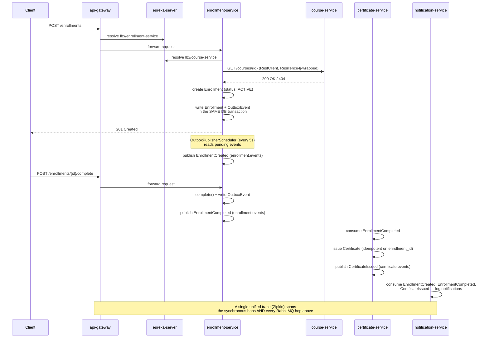

# EduFlow Cloud

[🇧🇷 Português](README.PT-BR.md)

A cloud-native online learning platform built with 7 independent Spring Boot modules — 4 business microservices behind a real Spring Cloud infrastructure stack (Config Server, Eureka, API Gateway) — designed to close a specific architectural gap left open by my previous project: service-to-service communication over hardcoded URLs, with no discovery and no centralized configuration. Built as a portfolio project for Java backend internship/junior roles.

The system lets a student enroll in a course, complete it, and automatically receive a certificate — with every step of that flow observable end-to-end, resilient to partial failures, and reconfigurable at runtime without restarting a single process.

## Why this project

[order-processing-system](https://github.com/Rangeldev73/order-processing-system) (my previous project) proved I could build a real choreographed saga with idempotent consumers, dead-letter queues, and circuit breakers — but every service found every other service through a hardcoded URL. That doesn't scale, and it doesn't reflect how real distributed systems are actually wired. EduFlow Cloud exists specifically to close that gap: dynamic service discovery (Eureka), centralized and dynamically-refreshable configuration (Config Server + Spring Cloud Bus), a single routed entry point (API Gateway), and full request/event tracing across both synchronous and asynchronous hops (Micrometer Tracing + Zipkin). On top of that infrastructure, the project also revisits and properly solves a trade-off I had accepted as technical debt in the previous project — the dual-write problem between a database commit and a message publish — via the Transactional Outbox pattern.

## Features

- **4 business microservices, fully event-connected** — `course-service`, `enrollment-service`, `certificate-service`, `notification-service`, each with its own bounded context and (where applicable) its own PostgreSQL database.
- **Full infrastructure stack, not simulated** — Spring Cloud Config Server (Git-backed, [separate repo](https://github.com/Rangeldev73/eduflow-config)), Eureka (dynamic service discovery), and Spring Cloud Gateway (single routed entry point, resolving `lb://course-service` and `lb://enrollment-service` dynamically instead of hardcoded addresses).
- **A real chained event flow, not a single hop** — `enrollment-service` publishes `EnrollmentCreated`/`EnrollmentCompleted`; `certificate-service` consumes the latter, issues a certificate, and itself publishes `CertificateIssued`; `notification-service` reacts to all three. `certificate-service` is both a consumer and a producer.
- **Transactional Outbox Pattern** — `enrollment-service` no longer publishes to RabbitMQ directly from the use case. Every outgoing event is written to a `tb_outbox_event` table in the *same* database transaction as the business write, guaranteeing the event is never lost even if RabbitMQ is unreachable at that instant. A separate scheduled publisher (5s polling) reads pending rows and publishes them, each in its own transaction.
- **Idempotency at every consumer boundary** — `certificate-service` treats RabbitMQ's at-least-once delivery as a given: a unique constraint on `enrollment_id` makes re-processing a duplicate `EnrollmentCompleted` a no-op, not a duplicate certificate.
- **Resilience4j on the one synchronous call in the system** — `enrollment-service` validates that a course actually exists (via `RestClient`, load-balanced through Eureka) before creating an enrollment, wrapped in a circuit breaker (outer) + retry (inner). A confirmed "course doesn't exist" (404) and a "course-service is unreachable" (circuit open) are two different, deliberately distinguished outcomes — the second never silently degrades into the first.
- **Distributed tracing across sync *and* async hops** — Micrometer Tracing + Zipkin instrument the whole business flow, including RabbitMQ publishers and listeners (which are *not* traced by default and had to be explicitly enabled), producing a single unified trace from the Gateway all the way to the notification log line.
- **Dynamic configuration refresh, no restarts** — Spring Cloud Bus (over the same RabbitMQ broker already running for business events) propagates a single `/actuator/busrefresh` call on any one instance to every `@RefreshScope` bean across all 5 business-facing services.
- **Real optimistic concurrency control, including a documented Hibernate gotcha** — `Course`'s `@Version` does *not* increment when a `Module` is added through the JPA-managed parent-child association (Hibernate only bumps the version on changes to the owning row itself). A dedicated concurrency test proved this, and the fix — `LockModeType.OPTIMISTIC_FORCE_INCREMENT` on the read — is applied specifically where the aggregate's real invariant (module ordering) needs it.
- **Pragmatic Domain Model, by deliberate contrast with my previous work** — unlike [CourtFlow](https://github.com/Rangeldev73/courtflow), which keeps domain entities fully separated from JPA persistence entities, this project's domain classes *are* the JPA entities. That's a conscious trade-off for this project's scope (infrastructure and inter-service communication, not architectural purism) — documented here rather than left implicit.
- **Fully containerized** — all 7 modules, plus PostgreSQL, RabbitMQ, and Zipkin, run as Docker containers behind a single `docker-compose up`, with healthchecks enforcing the correct startup order automatically.
- **Unit test coverage on every aggregate's invariants** — `Course`/`Module` (contiguous ordering, encapsulated collection), `Enrollment` (symmetric state-transition guards), `Certificate` (immutability, code format), and `OutboxEvent` (publish-once guard), plus a dedicated concurrency test proving the Hibernate versioning gotcha above.

## Tech stack

| Layer | Technology |
|---|---|
| Language / Runtime | Java 21 |
| Framework | Spring Boot 4.1 |
| Cloud stack | Spring Cloud 2025.1.2 — Config Server, Eureka, Gateway (MVC/blocking variant), Bus |
| Build | Maven (multi-module, single parent POM managing the Spring Boot + Spring Cloud BOMs) |
| Persistence | Spring Data JPA, PostgreSQL (one container, one database per service that needs one) |
| Migrations | Flyway (schema-as-code end to end — no `ddl-auto`) |
| Messaging | RabbitMQ (topic exchanges, Jackson JSON message conversion, Transactional Outbox in `enrollment-service`) |
| Resilience | Resilience4j (circuit breaker + retry) on the one synchronous inter-service call |
| Observability | Micrometer Tracing + Zipkin, across both HTTP and RabbitMQ hops |
| Testing | JUnit 5, AssertJ |
| Containerization | Docker Compose for the entire stack — a dedicated `Dockerfile` per module (7 total) plus PostgreSQL ×3, RabbitMQ and Zipkin, wired together on the Docker network with healthcheck-driven startup ordering |

## Architecture

### Services

| Service | Role | Exposes REST | Database | Port |
|---|---|---|---|---|
| `course-service` | Owns the course catalog — `Course` aggregate root with contiguous, ordered `Module`s | `POST /courses`, `POST /courses/{id}/modules`, `GET /courses/{id}` | `course_db` | 8082 |
| `enrollment-service` | Owns the enrollment lifecycle (`ACTIVE` → `COMPLETED`/`CANCELLED`), validates course existence synchronously, publishes events via the Outbox pattern | `POST /enrollments`, `POST /enrollments/{id}/complete`, `POST /enrollments/{id}/cancel`, `GET /enrollments/{id}` | `enrollment_db` | 8081 |
| `certificate-service` | Consumes `EnrollmentCompleted`, idempotently issues a `Certificate` with a public verification code, publishes `CertificateIssued` | — | `certificate_db` | 8083 |
| `notification-service` | Terminal consumer — reacts to `EnrollmentCreated`, `EnrollmentCompleted`, and `CertificateIssued`, logs a simulated notification | — | none | 8084 |

### Infrastructure

| Component | Role | Port |
|---|---|---|
| `config-server` | Serves centralized configuration, cloned from the [`eduflow-config`](https://github.com/Rangeldev73/eduflow-config) Git repository | 8888 |
| `eureka-server` | Dynamic service discovery — every business service and the Gateway register here | 8761 |
| `api-gateway` | Single routed entry point (`spring-cloud-starter-gateway-server-webmvc`); resolves `lb://course-service` and `lb://enrollment-service` through Eureka. Routing only in this iteration — no authentication or rate limiting yet | 8080 |
| RabbitMQ | Backs both business events (`enrollment.events`, `certificate.events`) and the Spring Cloud Bus config-refresh channel | 5672 / 15672 (management UI) |
| Zipkin | Collects and displays distributed traces across all 5 business services | 9411 |

### End-to-end flow



### Clean Architecture (per business service)

```
domain/
  model/       → JPA entities that ARE the domain model (see "Design decisions" below)
  exception/   → business exceptions

application/
  usecase/     → one use case per operation, orchestrating domain + repositories + outbound calls
  dto/
    request/   → request DTOs, Bean Validation as a defense-in-depth layer over domain validation
    response/  → response DTOs

infrastructure/
  web/         → controllers, centralized exception handling with a consistent error contract
  persistence/ → Spring Data JPA repositories
  messaging/   → RabbitMQ config, producers, listeners, outbox publisher (enrollment-service)
  client/      → load-balanced RestClient for the one synchronous inter-service call (enrollment-service only)
```

## Design decisions worth reading

- **Domain = JPA entity, by deliberate contrast with CourtFlow.** This project's `Course`, `Enrollment`, and `Certificate` are annotated directly with `@Entity`/`@Id`/`@Column` — there's no separate persistence-mapping layer. CourtFlow keeps those fully apart. Both are legitimate trade-offs; this project's focus is inter-service communication and cloud infrastructure, not Clean Architecture purism, and showing both approaches across two portfolio projects is itself the point.
- **A `@Version` field doesn't protect what you'd assume it protects.** Adding a `Module` to a `Course` only issues an `INSERT` on the child table — Hibernate does not bump the parent's `version` column, because from its perspective the parent row never changed. A dedicated concurrency test proved two simultaneous `addModule()` calls do **not** trigger `OptimisticLockingFailureException` under the default `findById()`. The fix uses `@Lock(LockModeType.OPTIMISTIC_FORCE_INCREMENT)` on the specific read path that needs the aggregate-level guarantee, while the database `UNIQUE` constraint on `(course_id, module_order)` remains as the final, unconditional safety net.
- **The Outbox Pattern only exists where the dual-write problem was actually identified and documented — not copy-pasted everywhere.** `enrollment-service` is the only service using it. `certificate-service` still publishes directly, protected only by a try/catch that logs and swallows a broker failure — a smaller, explicitly accepted risk, since replicating the full pattern there wouldn't have taught anything new.
- **A confirmed "not found" and an "unreachable" are never the same return value.** `CourseClient.existsById()` returns `true`/`false` only for a call that actually completed (a 200 or a 404 from `course-service`). Any circuit-breaker fallback or transport failure throws `CourseServiceUnavailableException` (→ 503) instead — silently returning `false` on a timeout would have blocked a valid enrollment because of a transient network blip, not a real business rule.
- **RabbitMQ tracing is opt-in, not automatic.** Unlike HTTP calls, which Spring instruments out of the box, RabbitMQ publishers and listeners needed `spring.rabbitmq.template.observation-enabled` / `spring.rabbitmq.listener.simple.observation-enabled` explicitly set to `true` — otherwise a trace would visibly stop at the Gateway/REST boundary and never show the RabbitMQ hops that make up most of this system's actual behavior.
- **`localhost` means something different inside a container.** Every piece of configuration in this project originally pointed at `localhost` (Eureka, Config Server, the datasources, RabbitMQ, Zipkin) because every process ran on the same host. Moving to Docker Compose broke that silently at first — each container has its own isolated `localhost`, so a service trying to reach `localhost:8761` from inside its own container is looking for Eureka inside itself, not in the `eureka-server` container. The fix was switching every one of those references to the Docker Compose service name (`eureka-server`, `config-server`, `eduflow-rabbitmq`, etc.), which Docker's internal DNS resolves automatically — including inside the centrally-managed configuration served from the separate [`eduflow-config`](https://github.com/Rangeldev73/eduflow-config) repository, which needed the same fix.
- **Spring Boot 4.1 quietly renamed or re-modularized several things this project depends on**, each discovered by hitting a silent failure rather than an error message: Flyway's auto-configuration moved to its own starter (`spring-boot-starter-flyway`) and simply never runs without it; `spring-boot-starter-web` was renamed to `spring-boot-starter-webmvc`; Spring Cloud Gateway's MVC variant uses the `spring.cloud.gateway.server.webmvc.*` property prefix, not the reactive one; Zipkin support moved to `spring-boot-starter-zipkin` with the property now under `management.tracing.export.zipkin.*`. Documenting these here so the next debugging session (mine or anyone else's) starts faster.

## How to run

The entire stack — all 7 Spring Boot modules plus PostgreSQL, RabbitMQ, and Zipkin — runs via Docker Compose. Healthchecks enforce the correct startup order automatically (Config Server → Eureka → everything else), so there's no manual sequencing involved.

```bash
git clone https://github.com/Rangeldev73/eduflow-cloud.git
cd eduflow-cloud
cp .env.example .env
# adjust credentials in .env if you'd like
docker-compose up --build
```

| Service | Port |
|---|---|
| `config-server` | 8888 |
| `eureka-server` (dashboard) | 8761 |
| `api-gateway` | 8080 |
| `course-service` | 8082 |
| `enrollment-service` | 8081 |
| `certificate-service` | 8083 |
| `notification-service` | 8084 |
| RabbitMQ management UI | 15672 |
| Zipkin UI | 9411 |

### Try it

```bash
# 1. Create a course
curl -X POST http://localhost:8080/courses \
  -H "Content-Type: application/json" \
  -d '{"title":"Clean Architecture","description":"Mastering software architecture","level":"ADVANCED"}'

# 2. Enroll a student (replace {courseId} with the id returned above)
curl -X POST http://localhost:8080/enrollments \
  -H "Content-Type: application/json" \
  -d '{"studentId":"3fa85f64-5717-4562-b3fc-2c963f66afa6","courseId":"{courseId}"}'

# 3. Complete the enrollment (replace {enrollmentId})
curl -X POST http://localhost:8080/enrollments/{enrollmentId}/complete
```

Watch the `notification-service` container logs for the enrollment, completion, and — a few seconds later, once the Outbox publisher and the certificate chain run — the certificate issuance. Open `http://localhost:9411` to see the full trace, and `http://localhost:8761` to see all 5 business services registered.

## Testing

```bash
./mvnw test
```

Run from each service's own directory. Tests focus on pure domain logic (state machines and invariants, no framework involved) plus a dedicated concurrency test in `course-service` (`CourseConcurrencyTest`) that specifically proves the Hibernate versioning gotcha described above.

## Known limitations / open items

- No API Gateway authentication or rate limiting yet — this iteration focused on proving dynamic routing through Eureka; centralized auth would require a dedicated identity service that's out of scope here.
- `studentId` is an unvalidated UUID — there's no user/identity service in this project's scope, so `enrollment-service` never confirms a student actually exists.
- Course prerequisites are not modeled. `enrollment-service` deliberately doesn't yet check whether a student completed a prerequisite course before allowing a new enrollment — the data needed for that decision (completion status) lives in `enrollment-service` itself, so this is a matter of adding the check, not a cross-service design gap.
- The Transactional Outbox pattern is implemented only in `enrollment-service`; `certificate-service` still publishes directly with a try/catch fallback (a smaller, explicitly accepted risk).
- `eureka-server` runs with `enable-self-preservation: false`, which is correct for a single-instance local setup but would need to be reverted to `true` before this could run in a real multi-instance production environment.
- No Kubernetes and no cloud deployment — this project is fully containerized with Docker Compose, but its scope stops at Spring Cloud architecture and inter-service communication patterns, evaluated locally.